# Aula 3

As redes tinhasm meios para se comunicar entre si (fibra ótica,...), elas podiam ter um intermediario ou não.  

Para classificar a escala da rede, o alcance delas, usamos as seguintes termonologias  
WANs: Wide Area Networks (mundo inteiro)  
LANs: Local Area Networks (local, rede pequena)  
MANs: Metropolitan Area Networks (por exemplo, rede do rio de janeiro)   
SANs: Storage Area Networks (obsoleta)  
CANs: Campus Area Networks (obsoleta, rede da puc)

## Topologia
É a forma como nós arrumamos a comunicação entre os usuários, a escolha de topologia pode afetar muito os usuários.  
Existe dois grandes/famosos métodos de arrumar os meios.  

### Multi-Ponto  
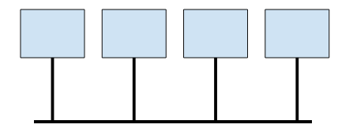  
Os dispositivos compartilham uma mesma barra para se comunicarem.  

### Ponto a Ponto  
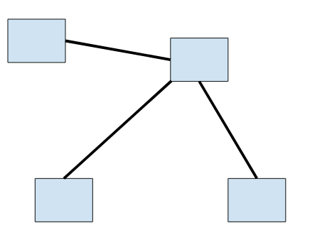  
Um dispositivo passa informação pra uma pessoa qualquer e essa pessoa passa para o alvo.  
Uma transmissão ponto a ponto pode ser usada de varias maneiras  

Simplex: Uma ligação que você projetou esse meio de maneira que um lado só tem transmissor e o outro receptor, ou seja, só pode usar em um sentido.  
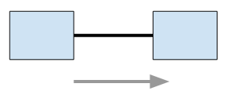  

Half-duplex: Tem transmissores e receptores em ambos os lados, mas não pode usar os dois ao mesmo tempo, ou seja, enquanto estiver sendo usado para um sentido, não pode ser usado para o outro.  
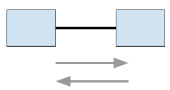  

Full-duplex: Consegue fazer ambos sentidos ao mesmo tempo  
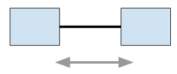  

### Topologia totalmente ligada
Considerada a melhor topologia em todos os casos, ligar todos a todos.  
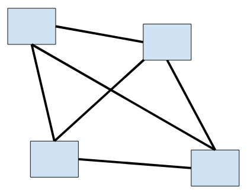  
Essa topologia deixa você quase sem nenhum problema:  
* Não precisa endereçar ninguém, pois se está sendo transmitido pelo cabo da pessoa X, então a informação é para a pessoa X.  
* A disponibilidade da rede é a maior possivel, pois toda comunicação seria full-duplex, ou seja, se todos quisessem falar com todos ao mesmo tempo, a rede suportaria.  

Qual o problema então? Custo, para cada computador adicionado na rede, teria que adicionar n-1 cabos.  
O total de cabos seria n.(n-1)/2.  

### Topologia parcialmente ligada
A ideia é ter menos cabos mas manter o grafo conexo, ou seja, qualquer um consegue chegar em qualquer um, mas não precisa ser diretamente. Você também não quer reduzir a ponto de tornar uma árvore, isso acabaria deixando 1 caminho sendo obrigátorio para muitos computadores na rede.    
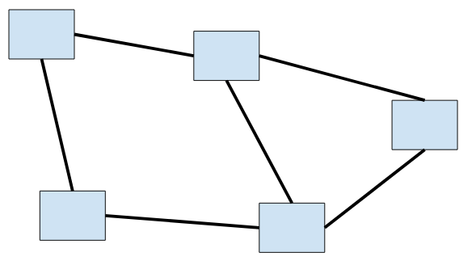
Agora você tem os problemas que a outra solucionava:  
* Precisa endereçar, um método que diga de quem é a informação que você ta passando.   
* Saber para quem passar a informação, quem sabe o alvo da informação. A solução para isso é cada computador ter uma tabela com os endereços possíveis, dizendo para quem você tem que passar para chegar no seu alvo.  
* Se todos os cabos estivessem ocupados, você não conseguiria falar com aquele computador.  
* Garantir que todos conseguem chegar em todos, vai precisar de um algoritmo para descobrir se adicionar ou remover um cabo vai tirar conectividade.  

Como vamos fazer para garantir que uma informação chegue no alvo?  
Como os telefones fazem para saber para quem é a ligação?  
Dizendo o número da pessoa.  
A central telefônica tem uma tabela de rotas para os telefones, nessa tabela também tem outras centrais que podem saber a rota para o número desejado.  
A central que recebeu seu número reserva a sua conexão e pede para outra central tentar achar o número, essa segunda central repete esse procedimento.  
Até que dessa forma você tenha uma conexão reservada para você até o outro número.  

Considere azul pessoa e amarelo central.  
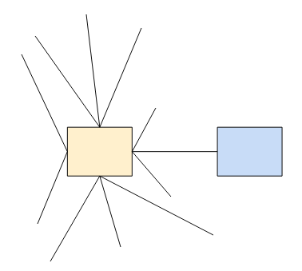  
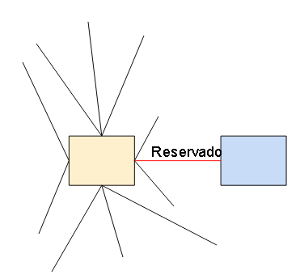  
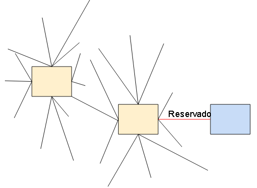  
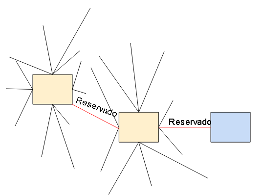  
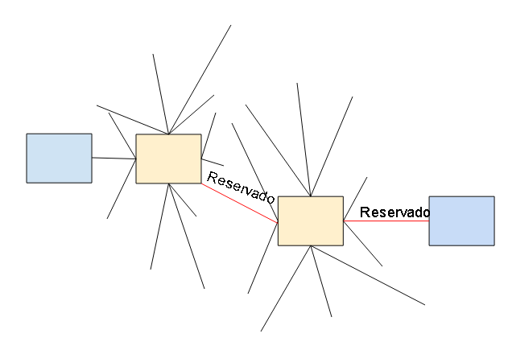  
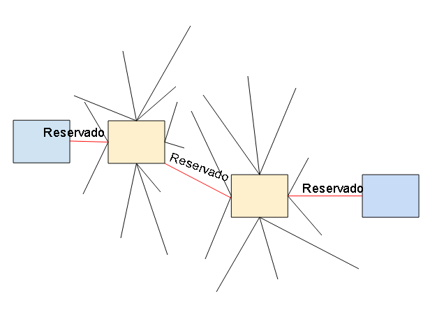  

O nome de todo esse processo é **comutação de circuitos**.  
O que você precisa saber sobre ele:  
* Você precisa ter etapas de **estabelecimento** e **rompimento** de conexão.  
  * Roteamento durante o estabelecimento (roteamento =  escolha da rota).  
  * Endereçamento é necessário para o estabelecimento.  
  * Essas etapas são procedimentos de sinalização.  
* Um **canal/caminho** continua reservado para os dois durante todo o tempo de **conexão/chamada/ligação**.  
* O retardo de informações é constante, pois a conexão fica reservada para eles até eles terminarem de usar, então a demora é sempre a mesma para a informação chegar.  
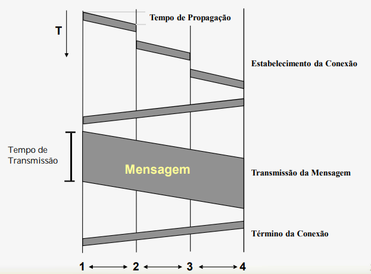

Lado positivo de comutação de circuitos:
* Ótimo para transferências continuas, tipo voz ou video. Nesse tipo de conexão é bom manter a conexão reservada para os dois que estão usando voz/video, se não causaria pausa na voz ou no video. (**tráfego contínuo**)  

Lado negativo de comutação de circuitos:
* Você vai estar reservando uma conexão, ou seja, enquanto você estiver usando ninguém mais pode usar. Imagina reserva um caminho para alguém que está apenas navegando na internet, ou seja, apenas baixa informação quando clica em algum link. (**tráfego de dados convencionais**)  

Como pode ver traz um grande disperdicio reserva uma conexão inteira apenas para fazer coisas simples tipo carregar página ou baixar dados.  
