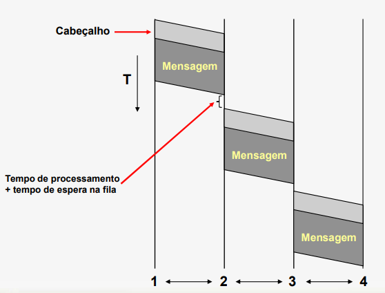
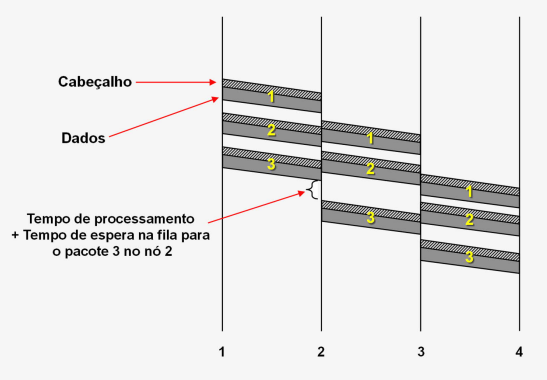
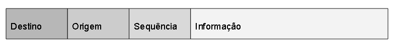
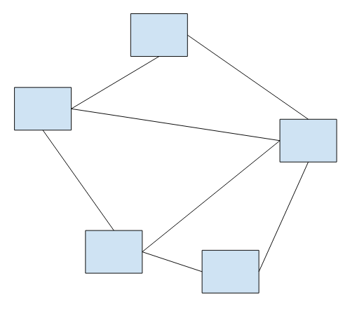
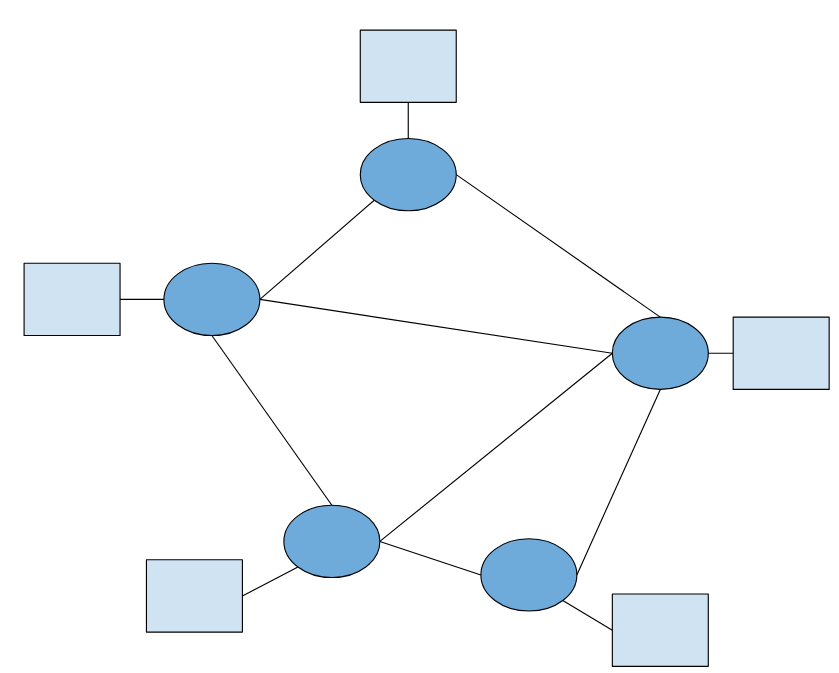
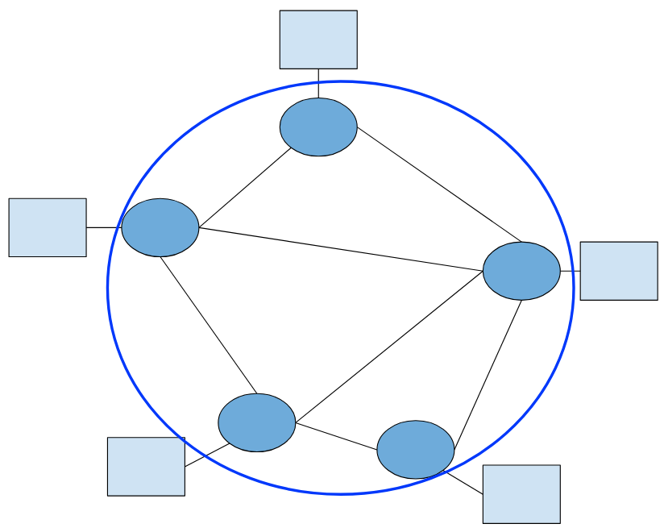

# Aula 4

**Comutação de mensagens** é uma alternativa a comutação de circuitos para tráfego de dados convencionais, esse método está obsoleto pois tem um melhor mas continua sendo melhor que a comutação de circuitos para caso de tráfego de dados convencionais.  
Diferente da outra comutação, você não reserva uma conexão, você simplesmente prepara uma 'mensagem' com as informações que você quer passar e envia.  
Junto dessa mensagem você muitas vezes precisa incluir coisas como endereço do alvo, seu endereço, ...  
Em comutação de circuitos, você manda o endereçamento antes de enviar o resto das informações e fazer a conexão.  
Em comutação de mensagens, você manda o endereçamento junto da informação/mensagem.  

Note que todos precisam estar seguindo a mesma norma/padronização em relação a  mensagem (por exemplo, endereçamento é a primeira coisa da mensagem).  

Lado positivo é que você manda a mensagem, ela passa pelo cabo e já deixa o cabo liberado para outra pessoa usar. Não fica reservando conexão.  

O procedimento que cada computador tem que fazer é **armazenar**, **escolher rota** e **encaminhar**. (**store-and-forward**)  
Computador recebe a mensagen (armazena ela), descobre a rota e tenta encaminhar.  
Enquanto a rota não ficar disponível, o computador acumula varias mensagens recebidas.  

O ruim de comutação de mensagens é que você apenas envia a mensagem como inteiro e recebe como inteiro.  
Precisa esperar a mensagem ser feita por completo para depois enviar por completo.  
O computador que está recebendo fica com aquela conexão reservada esperando toda a mensagem chegar.  

**Comutação de pacotes** é uma evolução da comutação de mensagens, pois agora você vai dividir uma mensagens em varias partes (chamaremos de pacotes). Você tem que botar o endereço em cada pacote e isso vai custar mais tempo, mas agora você pode já preparar pedaço da mensagem e enviar, isso vai acelerar bastante o envio de mensagem.  

Cada pacote é encaminhado conforme fica pronto, mas a rota de cada pacote pode ser diferente pois a rede vai mandar o pacote pela rota que achar melhor (menos tráfico ou que demora menos para chegar no alvo).  

Isso pode fazer com que pacotes cheguem fora de ordem, para solucionar esse problema os pacotes também vão incluir o número de sequência. Dessa maneira quando o pacote chegar no alvo, o alvo pode botar os pacotes em ordem e remontar a mensagem.  

Por que é mais rápido do que comutação de mensagem?  
Comutação de mensagem apenas vai começar a repassar a mensagem quando terminar de receber.  
Comutação de pacotes vai repassar conforme os pacotes ficam prontos.  

Comutação de mensagem  
  
Comutação de pacotes  
  

Em comutação de circuitos o retardo(lag) é constante, pois uma conexão está sendo reservada para vocês, o retardo vai ser o mesmo desdo momento que você estabeleceu a conexão.  
Em comutação de pacotes o retardo é variável, pois cada pacote pode levar um certo tempo de acordo com a rota que pegar para chegar no alvo.  

### Formato do pacote
Como você deveria organizar o pacote para ajudar em todo o processo de enviar os pacotes.  
  
Destino, origem e sequência formam juntos o cabeçalho do pacote.  
Informação é a parte útil do pacote.  

### Rede geograficamente distribuida
Embora tenhamos representado a rede dessa maneira  
  
Essa não é a maneira certa pois nenhum usuário quer que o computador perca tempo com tarefas que não são para ele, por isso que não usamos isso no computador do usuário mas sim em um computador intermediário.  
  
  
