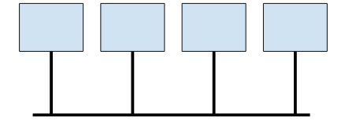
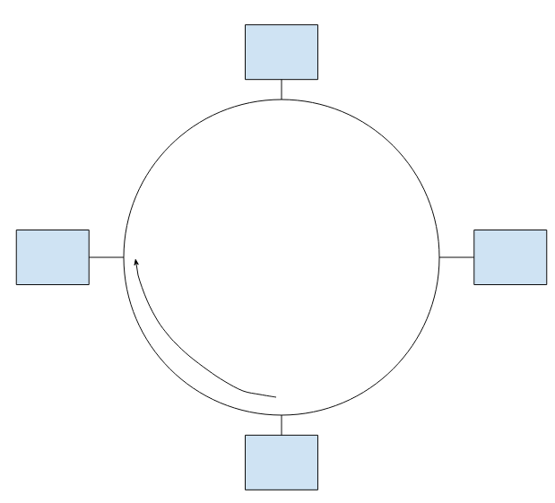

# Aula 5

## LANs
Qual é a idéia de uma rede local? Fácil de usar e pouca infra estrutura. Não precisar de toda a lógica que as redes tem (virtua/tim...), não precisa de roteamento.  

Quais os 3 métodos princípais de LANs?  
* Barra  
* Anel  
* Estrela  

### Barra 
  
A idéia é que qualquer um pode transmitir e essa transmissão vai correr por toda a barra, ou seja, passar por todos conectados. Não precisa de um intermediário cuidando da informação.  
Que problema você já ve de cara? Tudo que você transmite, chega em todo mundo (físicamente).  
Para solucionar o problema de todos ficarem lendo informações que não os interessa, criamos a noção de pacote onde botamos o endereço de destino no cabeçalho e criamos um hardware em cada computador que verifica se o pacote é para ele, se for passa para o usuário princiapl, se não joga fora a informação.  
Mas se quisermos mandar para todos? Teremos que mandar varias vezes e cada pacote com o endereço de destino certo? Para resolver isso criamos um endereçamento especial que equivale a **broadcast**, dessa forma os hardware além de lerem o que tem o endereço deles, vai ler o que for broadcast.  

**Unicast**: Para alguém específico  
**Broadcast**: Para todos lerem  
**Multicast**: Para mais de uma pessoa porém não todas  

Se uma pessoa desativar a parte do hardware que filtra pelo endereço, a pessoa entra em um modo **espião** pois vai poder ler qualquer mensagem que receber.  

Duas estações podem começar a transmitir ao mesmo tempo, quando isso ocorre as informações acabam por se **colidir**, quando se colidem a informção vira lixo. Para solucionar isso, precisamos usar algum tipo de controle, no caso vamos fazer todos usarem uma mesma política para evitar colisão (ou seja, antes de transmitir vai obdecer uma regra).  
**MAC**: Medium Acess Control  

### Anel 

No anel cada estação tem uma interface, um lado dessa interface só transmite, no outro só recebe. Isso cria um fluxo/sentido de transmissão, igual a um simplex, e todos no anel precisam seguir o mesmo fluxo.   
A interface verifica se o pacote é pra ela, se for ela lê.  

Algumas pessoas acham que no momento que ela lê, ela não repassa mais a informação, isso está incorreto. A interface sempre passa o pacote a diante.  
O anel tem um **repetidor**, no momento que a interface recebe um bit, ele repete esse bit para fora da interface (passa a diante).  
Ele também repete cada bit que chega para um buffer interno da interface de 48 bits, que é justamente o tamanho do endereçamento no pacote.  
Ou seja, no mesmo tempo que ele ta passando a diante os bits, ele está copiando.  

Agora que você tem o endereçamento você verifica se é para sua estação, se for você continua a receber as informações. Mesmo se não fosse para a estação, o repetidor iria repetir os bits para fora (passar a diante).  

Todas as interfaces fazem isso, isso poderia causar um problema de loop infinito. Para solucionar o problema, alguém tem que remover esse pacote do fluxo, o responsável por isso vai ser o mesmo que enviou o pacote.  
Note que quem enviou não pode ficar verificando se mensagem é para ele, pois o repetidor iria repassar o pacote nesse mesmo tempo. Por isso que ao enviar um pacote, ela assumi que a próxima coisa que vai receber de volta é o mesmo pacote que enviou e então ela entra em um modo que joga fora a próxima coisa que receber.  

Isso evita o problema de colisão, mas claramente isso pode dar algum problema. Imagina duas estações começam a transmitir ao mesmo tempo, cada uma vai jogar na informação do outro no lixo.  
