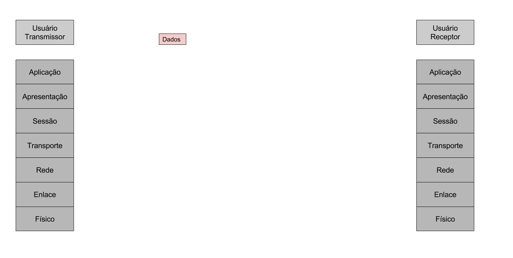
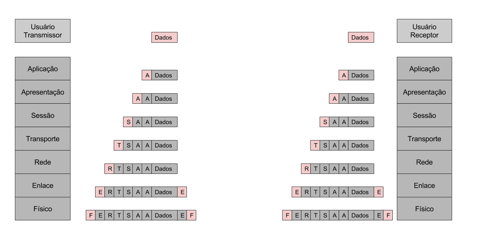
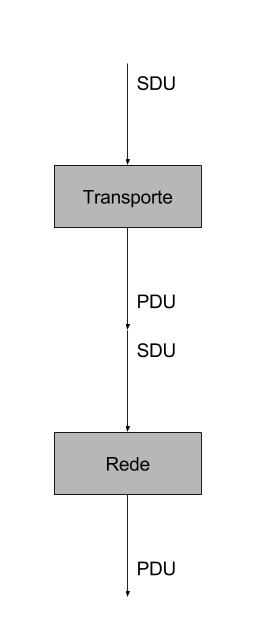
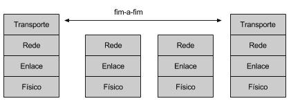

# OSI
Segue o princípio de "dividir para conquistar", criar diversas camadas onde cada uma se responsabiliza por uma tarefa.  
Cada camada utiliza os serviços da camada abaixo e oferece serviços a camada acima.  
Cada camada supõe que qualquer erro de fora dessa camada, vai ter sido tratado fora dessa camada e o que recebe não tem erro.  
O padrão de como cada camada recebe ou passa informação permite a alteração da camada em si sem alterar as outras.  
Com isso torna muito mais fácil modificações na rede sem alterar tudo ou quebrar algo.  

# Camadas
O modelo OSI propoem dividir em 7 camadas.

* **Aplicação**
* **Apresentação**
* **Sessão**
* **Transporte**
* **Rede**
* **Enlace**
* **Físico**

# Transferência de dados
  

Como pode ver cada camada acrescenta mais informação ao pacote da pessoa que quer transmitir dados, por sua vez o receptor tem essas mesmas camadas justamente para ler essas partes de informações.  
Algumas camadas podem botar apenas no ínicio do seu pacote a informação extra, outras botam no ínicio e no fim... Cada camada segue seu estilo, o que importa é que o receptor saiba como é.  
  

SDU (**Service Data Unit**) são os dados recebidos justamente da camada de cima, sem ter tido qualquer alteração.  
PDU (**Protocol Data Unit**) são os dados já encapsulados no protocolo da camada. Esse é passado para a próxima camada como o SDU dela.  
  

# Físico
* Transmissão de bits através de um canal de comunicação (cabo/wifi/...)
* Características do meio físico e da transmissão do sinal
  * Características mecânicas
  * Características elétricas
  * Características funcionais
  * Características procedurais
  
# Enlace
* Detecta e opcionalmente corrige erros que por ventura ocorram no nível físico (dessa maneira aumentando a confiabilidade da informação)
  * Quando detectar erro (e não conseguir corrigir) deve-se jogar a informação fora, a camada acima não deve receber informação incorreta/corrompida...
* Transmissão e recepção de quadros (delimitação)
* Controle de fluxo

# Rede
* Roteamento (decidir o caminho do pacote até o destino)
* Encaminhamento

# Transporte
* Fornece uma comunicação fim-a-fim, ou seja, elas não passam nenhuma informação que é útil para as camadas abaixo, a informação dela é útil apenas para a própria camada
  * Detectação de erros fim-a-fim
  * Controle de fluxo fim-a-fim (opcional)
  * Recuperação de erros fim-a-fim (opcional)
* Segmentação e remontagem de mensagens

# Sessão
* Controle de Diálogo
  * Pontos de sincronização
  * Recuperação da sessão em caso de falhas
* Controle dee Atividade
  * Agrupamento lógico de diálogos
  * Cada atividade corresponde a uma tarefa que pode ser interrompida e posteriormente retomada
