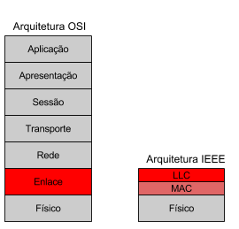
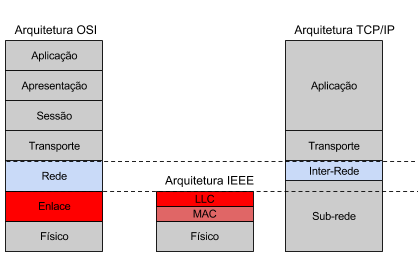

# Arquitetura IEEE 802
(Modelo OSI adotou a parte do IEEE eventualmente)  
  

IEEE propôs dividir o enlace em duas partes, LLC e MAC, acima dessas camadas IEEE não liga como é. 

# Físico
* Estabelecimento, manutenção e liberação de conexões físicas
* Transmissão de bits através de um meio físico
  * Cabo coaxial
  * Par trançado
  * Fibra ótica
* Método de codificação
* Taxa de transmissão

**Motivação da camada**: Igual a camada do OSI.  

# MAC
Medium Access Control
* Organização do acesso ao meio físico compartilhado
  * Barra
  * Anel
  * Wireless
* Técnicas
  * CSMA-CD (802.3)
  * Token Bus (802.4)
  * Token Ring (802.5)
  * DQDB (802.6)
  * etc
  
**Motivação da sub-camada**: Controlar quando se pode transmitir para outra estação, detectação de erro e endereçamento.  

# LLC
Logic Link Control
* Independência da camada MAC
* LSAPs
* Multiplexação
* Controle de erros e de fluxo
* Tipos de operação
* Classes de procedimento

**Motivação da sub-camada**: Acaba por ser mais as partes opcionais, correção de erro, confiabilidade...

# Arquitetura TCP/IP (Internet)
Já tinha a idéia de que você formaria uma rede grande atráves de redes menores autonomias, ou seja, inter-redes.  
  
Aplicação, apresentação e sessão viram apenas uma camada, chamada aplicação.   
A camada de transporte continua sendo igual mas obrigaram a saberem pelo menos 2 protocolos (TCP e UDP, um para circuito virtual e outro para datagrama).  
